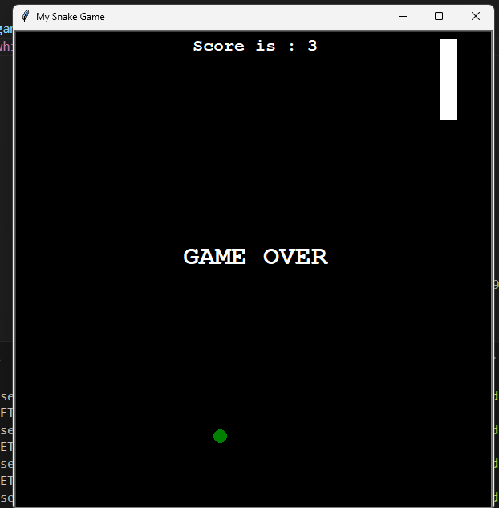

# Python Snake Game

A classic Snake game implemented in Python using the Turtle graphics library.

This project was created as part of the "100 Days of Code:   Python Pro " course on Udemy. Players control a snake to eat food, grow longer, and avoid colliding with walls or its own tail.

**Key Features:**

- Player control of the snake (up, down, left, right).
- Randomly generated food.
- Score tracking.
- Game over detection (wall and tail collisions).
